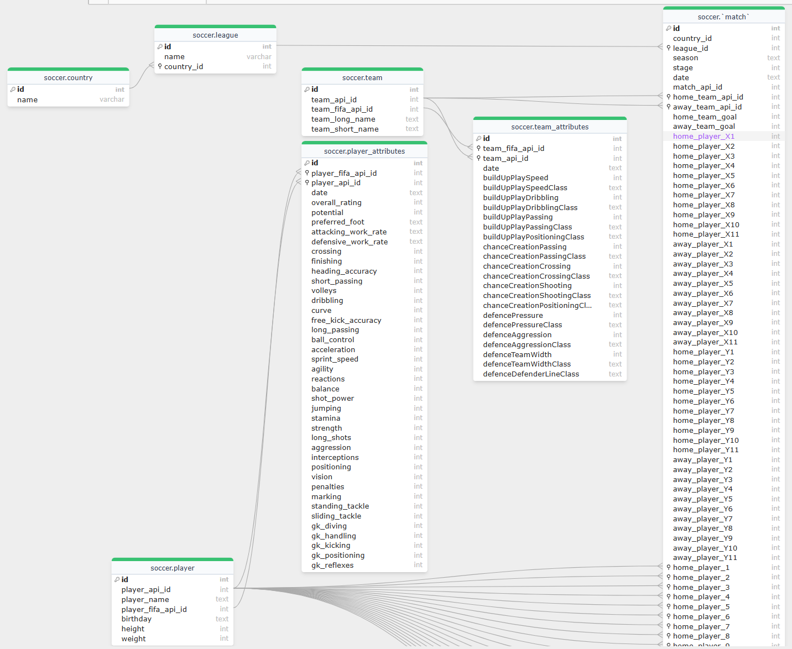

# European Soccer Analysis

## Summary
* Designed and implemented a relational database for analyzing soccer match data, including player and team attributes, using MySQL.
* Created dynamic SQL procedures and views to generate insights on top players, teams, and attribute comparisons.
* Leveraged data aggregation and filtering to analyze player performance trends and team strategies.

## Dataset: [soccer](https://www.kaggle.com/datasets/hugomathien/soccer)
* As the purpose of practice, I have reduced a large amount of data so that I can run the script in mysql smoothly.
* With script ["country-league-values.sql"](country-league-values.sql) helps to insert values (a.k.a rows) for country and league tables. [match-values.sql]("match-values.sql") for match table. ["player-values.sql"](player-values.sql) for player table.  ["player-attributes-values.sql"](player-attributes-values.sql) for player_attributes table. ["team-values.sql"](team-values.sql) for team table. ["team-attributes-values.sql"](team-attributes-values.sql) for team_attributes table. I keep them separately because **mysql** can't read too big files.
* Overview of tables:
    | Table             | Total Rows | Total Columns |
    |--------------------|------------|---------------|
    | country           | 11         | 2             |
    | league            | 11         | 3             |
    | match             | 1241      | 115           |
    | Player            | 1000      | 7             |
    | Player_Attributes | 2000     | 42            |
    | Team              | 296        | 5             |
    | Team_Attributes   | 1458       | 25            |

## Schema diagram

